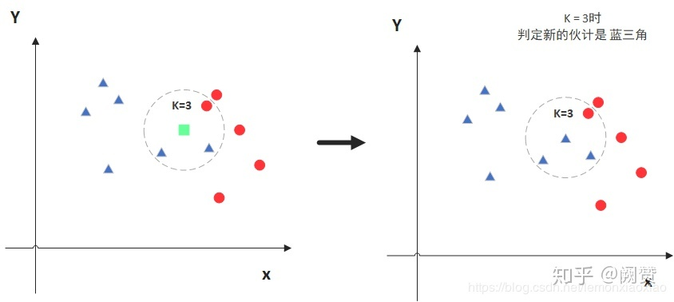
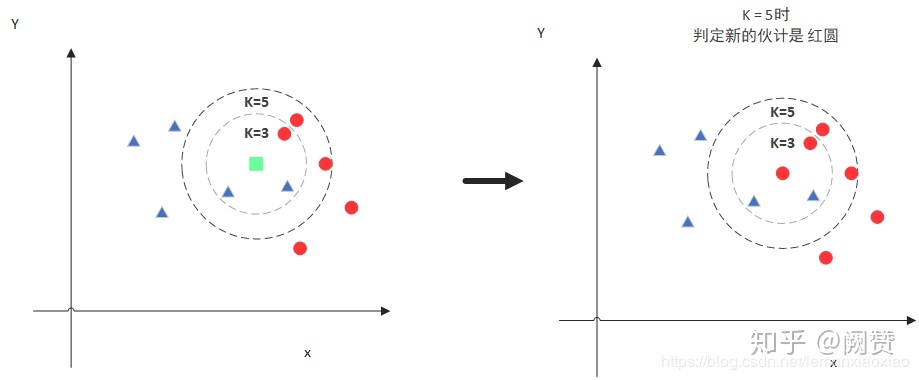
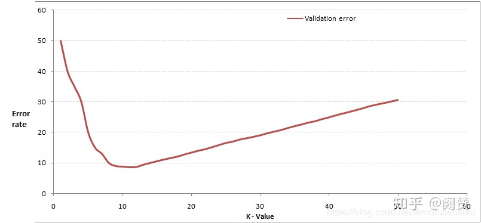

# 1. 概述
KNN 可以说是最简单的分类算法之一，同时，它也是最常用的分类算法之一。注意：KNN 算法是有监督学习中的分类算法，它看起来和另一个机器学习算法 K-means 有点像（K-means 是无监督学习算法），但却是有本质区别的。

# 2. 核心思想
KNN 的全称是 K Nearest Neighbors，意思是 K 个最近的邻居。从这个名字我们就能看出一些 KNN 算法的蛛丝马迹了。K 个最近邻居，毫无疑问，K 的取值肯定是至关重要的，那么最近的邻居又是怎么回事呢？其实，KNN 的原理就是当预测一个新的值 x 的时候，根据它距离最近的 K 个点是什么类别来判断 x 属于哪个类别。听起来有点绕，还是看看图吧。



- 图中绿色的点就是我们要预测的那个点，假设 K=3。那么 KNN 算法就会找到与它距离最近的三个点（这里用圆圈把它圈起来了），看看哪种类别多一些，比如这个例子中是蓝色三角形多一些，新来的绿色点就归类到蓝三角了。



- 但是，当 K=5 的时候，判定就变成不一样了。这次变成红圆多一些，所以新来的绿点被归类成红圆。从这个例子中，我们就能看得出 K 的取值是很重要的。

明白了大概原理后，我们就来说一说细节的东西吧，主要有两个，K 值的选取和点距离的计算。

## 2.1 距离计算
要度量空间中点距离的话，有好几种度量方式，比如常见的曼哈顿距离计算、欧式距离计算等等。


## 2.2 K值选择
通过上面那张图我们知道 K 的取值比较重要，那么该如何确定 K 取多少值好呢？答案是通过交叉验证（将样本数据按照一定比例，拆分出训练用的数据和验证用的数据，比如6：4拆分出部分训练数据和验证数据），从选取一个较小的 K 值开始，不断增加 K 的值，然后计算验证集合的方差，最终找到一个比较合适的 K 值。

通过交叉验证计算方差后你大致会得到下面这样的图：



这个图其实很好理解，当你增大 K 的时候，一般错误率会先降低，因为有周围更多的样本可以借鉴了，分类效果会变好。但注意，和 K-means 不一样，当 K 值更大的时候，错误率会更高。这也很好理解，比如说你一共就35个样本，当你 K 增大到30的时候，KNN 基本上就没意义了。


所以选择 K 点的时候可以选择一个较大的临界 K 点，当它继续增大或减小的时候，错误率都会上升，比如图中的 K=10。

# 3. 算法实现

## 3.1 Sklearn KNN参数概述

要使用 Sklearn KNN 算法进行分类，我们需要先了解 Sklearn KNN 算法的一些基本参数：

```python
def KNeighborsClassifier(n_neighbors = 5,
                       weights='uniform',
                       algorithm = '',
                       leaf_size = '30',
                       p = 2,
                       metric = 'minkowski',
                       metric_params = None,
                       n_jobs = None
                       ):
```

其中：
n_neighbors：这个值就是指 KNN 中的 “K”了。前面说到过，通过调整 K 值，算法会有不同的效果。
weights（权重）：最普遍的 KNN 算法无论距离如何，权重都一样，但有时候我们想搞点特殊化，比如距离更近的点让它更加重要。这时候就需要 weight 这个参数了，这个参数有三个可选参数的值，决定了如何分配权重。参数选项如下：
* ‘uniform’：不管远近权重都一样，就是最普通的 KNN 算法的形式。

* ‘distance’：权重和距离成反比，距离预测目标越近具有越高的权重。

* 自定义函数：自定义一个函数，根据输入的坐标值返回对应的权重，达到自

定义权重的目的。

algorithm：在 Sklearn 中，要构建 KNN 模型有三种构建方式：
1. 暴力法，就是直接计算距离存储比较的那种方式。

2. 使用 Kd 树构建 KNN 模型。

3. 使用球树构建。

其中暴力法适合数据较小的方式，否则效率会比较低。如果数据量比较大一般会选择用 Kd 树构建 KNN 模型，而当 Kd 树也比较慢的时候，则可以试试球树来构建 KNN。参数选项如下：

* ‘brute’ ：蛮力实现；

* ‘kd_tree’：KD 树实现 KNN；

* ‘ball_tree’：球树实现 KNN ；

* ‘auto’： 默认参数，自动选择合适的方法构建模型。

不过当数据较小或比较稀疏时，无论选择哪个最后都会使用 ‘brute’。

leaf_size：如果是选择蛮力实现，那么这个值是可以忽略的。当使用 Kd 树或球树，它就是停止建子树的叶子节点数量的阈值。默认30，但如果数据量增多这个参数需要增大，否则速度过慢不说，还容易过拟合。


p：和 metric 结合使用，当 metric 参数是 “minkowski” 的时候，p=1 为曼哈顿距离， p=2 为欧式距离。默认为p=2。


metric：指定距离度量方法，一般都是使用欧式距离。
* ‘euclidean’ ：欧式距离；

* ‘manhattan’：曼哈顿距离；

* ‘chebyshev’：切比雪夫距离；

* ‘minkowski’： 闵可夫斯基距离，默认参数。

n_jobs：指定多少个CPU进行运算，默认是-1，也就是全部都算。