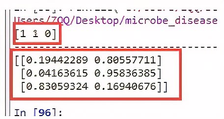

# k折交叉验证
为了解决简单交叉验证的不足，提出k-fold交叉验证。
```java
1、首先，将全部样本划分成k个大小相等的样本子集；
2、依次遍历这k个子集，每次把当前子集作为验证集，其余所有样本作为训练集，进行模型的训练和评估；
3、最后把k次评估指标的平均值作为最终的评估指标。在实际实验中，k通常取10.

```
举个例子：这里取k=10，如下图所示：
（1）先将原数据集分成10份
（2）每一将其中的一份作为测试集，剩下的9个（k-1）个作为训练集
此时训练集就变成了k * D（D表示每一份中包含的数据样本数）


（3）最后计算k次求得的分类率的平均值，作为该模型或者假设函数的真实分类率


# cross_val_score参数设置
sklearn.model_selection.cross_val_score(estimator, X, y=None, groups=None, scoring=None, cv=’warn’, n_jobs=None, verbose=0, fit_params=None, pre_dispatch=‘2*n_jobs’, error_score=’raise-deprecating’)
参数：

estimator： 需要使用交叉验证的算法
X： 输入样本数据
y： 样本标签
groups： 将数据集分割为训练/测试集时使用的样本的组标签（一般用不到）
scoring： 交叉验证最重要的就是他的验证方式，选择不同的评价方法，会产生不同的评价结果。具体可用哪些评价指标，官方已给出详细解释，链接：https://scikit-learn.org/stable/modules/model_evaluation.html#scoring-parameter


（具体的可以看这篇文章：https://blog.csdn.net/marsjhao/article/details/78678276）

cv： 交叉验证折数或可迭代的次数
n_jobs： 同时工作的cpu个数（-1代表全部）
verbose： 详细程度
fit_params： 传递给估计器（验证算法）的拟合方法的参数
pre_dispatch： 控制并行执行期间调度的作业数量。减少这个数量对于避免在CPU发送更多作业时CPU内存消耗的扩大是有用的。该参数可以是：

- 没有，在这种情况下，所有的工作立即创建并产生。将其用于轻量级和快速运行的作业，以避免由于按需产生作业而导致延迟
- 一个int，给出所产生的总工作的确切数量
- 一个字符串，给出一个表达式作为n_jobs的函数，如’2 * n_jobs
error_score： 如果在估计器拟合中发生错误，要分配给该分数的值（一般不需要指定）

# np.c_ 用于连接两个矩阵
np.c 中的c 是 column(列)的缩写，就是按列叠加两个矩阵，就是把两个矩阵左右组合，要求行数相等。

# python中ravel()用法
a = [[1, 2], [2, 3]]
a.ravel() #ravel()方法将数组维度拉成一维数组

# numpy.meshgrid()——生成网格点坐标矩阵。

# Python sklearn中的.fit与.predict的用法说明

```python
clf=KMeans(n_clusters=5) #创建分类器对象
fit_clf=clf.fit(X) #用训练器数据拟合分类器模型
clf.predict(X) #也可以给新数据数据对其预测

print(clf.cluster_centers_) #输出5个类的聚类中心

y_pred = clf.fit_predict(X) #用训练器数据X拟合分类器模型并对训练器数据X进行预测

print(y_pred) #输出预测结果
```

**补充知识：sklearn中调用某个机器学习模型model.predict(x)和model.predict_proba(x)的区别**

model.predict_proba(x)不同于model.predict()，它返回的预测值为获得所有结果的概率。（有多少个分类结果，每行就有多少个概率，对每个结果都有一个概率值，如0、1两分类就有两个概率）

我们直接上代码，通过具体例子来进一步讲解：

python3 代码实现： 

```python
# -*- coding: utf-8 -*-
"""
Created on Sat Jul 27 21:25:39 2019

@author: ZQQ
"""
from sklearn.linear_model import LogisticRegression
from sklearn.ensemble import RandomForestClassifier
from xgboost import XGBClassifier
import numpy as np
import warnings
warnings.filterwarnings("ignore")
# 这个方法只是解决了表面，没有根治

# 数据（特征，属性）
x_train = np.array([[1,2,3], 
          [1,5,4], 
          [2,2,2], 
          [4,5,6], 
          [3,5,4], 
          [1,7,2]]) 
# 数据的标签
y_train = np.array([1, 0, 1, 1, 0, 0]) 
 
# 测试数据
x_test = np.array([[2,1,2], 
          [3,2,6], 
          [2,6,4]]) 
 
# 导入模型
model = LogisticRegression() 
 
#model = RandomForestClassifier()

#model=XGBClassifier()

model.fit(x_train, y_train)

# 返回预测标签 
print(model.predict(x_test)) 
 
print('---------------------------------------')

# 返回预测属于某标签的概率 
print(model.predict_proba(x_test)) 

```



**分析结果**：

使用model.predict() :

预测[2,1,2]为1类

预测[3,2,6]为1类

预测[2,6,4]为0类

使用model.predict_proba() :

预测[2,1,2]的标签是0的概率为0.19442289，1的概率为0.80557711

预测[3,2,6]的标签是0的概率为0.04163615，1的概率为0.95836385

预测[2,6,4]的标签是0的概率为0.83059324，1的概率为0.16940676

预测为0类的概率值和预测为1的概率值和为1

同理，如果标签继续增加，3类：0，1, 2

预测为0类的概率值：a

预测为1类的概率值：b

预测为2类的概率值：c

预测出来的概率值的和a+b+c=1

**注：model.predict_proba()返回所有标签值可能性概率值，这些值是如何排序的呢？**

返回模型中每个类的样本概率，其中类按类self.classes_进行排序。

通过numpy.unique(label)方法，对label中的所有标签值进行从小到大的去重排序。

得到一个从小到大唯一值的排序。这也就对应于model.predict_proba()的行返回结果。

