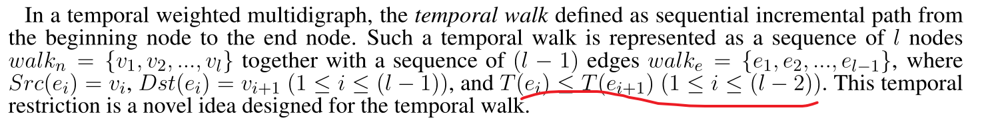

# Phishing Scam Detection on Ethereum: Towards Financial Security for Blockchain Ecosystem

## introduction

介绍了以太坊和和涉及的金融诈骗，钓鱼检测尤为重要，然后提出了我们用于钓鱼检测的方

- a graph-based cascade feature extraction method based on transaction records and a lightGBM-based Dual-sampling Ensemble algorithm

## Background and Related Work

介绍了比特币的一些相关概念，比如说地址就相当与银行招呼的account以及钓鱼诈骗造成的危害

## Proposed Method

构建图来提取特征，定义了朋友关系，其实也就是互相之间有事物交易，然后一级朋友，二级朋友提取特征

- Node data:  blocktime , out and in edge,amount of transactions
- Node features:  all kinds of information extracted from node data. Example: direction type method, in_block_std  and so on 
- N-order friend: A node's n-order friend is a node connected to the node with at least n-1 node
- N-order features: features extracted from N-order friend

**Dual-sampling Ensemble Method**

- Base model
  - LR ,SVM,DT and GBDT lightGBM
  - 用了哪些算法
  
## Data Collection and Preparation

下载数据的规模，节点数目和钓鱼节点数目

**Data Cleaning**

设置一些条件来对初始数据进行预处理，比如说根据时间，交易数量等

## Experiment Result and Analysis

几个模型对比分析，进行了一些改进，lightGBM表现最好，以及在什么条件下它表现最好，性能评价指数能达到多少。同时也选出了前十五重要的features。

# 总结

使用的是传统的机器学习算法，数据不具有同时性，不是很好。同时在数据的预处理我也觉得不是很好，虽然四千多万的节点筛选后七百多万，但是标签的1600多钓鱼地址筛选后只有300多，效果不是很好。亮点，让我了解一些新的特征提取，比如说交易在时间上的聚集度，这个不错。特征向量也挺多的。未来改进，我觉得应该是结合图神经网络和本篇论文的一些不错的特征进行分析

# TTAGN: Temporal Transaction Aggregation Graph Network for Ethereum Phishing Scams Detection

## introduction

介绍了以太坊以及以太坊设计的钓鱼诈骗和传统的钓鱼检测是不一样的。指出现有的钓鱼检测方法的不足——（1）(1) Lack of temporal transaction information （2）Weak node representation 然后提出自己的方法TTAGN，以及自己的方法是如何解决这两个不足的。 

## related work

介绍了目前钓鱼检测的两大方法，一类是机器学习，另外一类是网络嵌入，他们都很少使用临时交易信息。

## problem definition

将问题以数学符号形式表达

## design of TTAGN

构建原始图，由于原始图很大，所以我们采用随机漫步方式随机取样，随机去node然后随机取它的邻居构建子图，然后进行特征提取，取了十个特征。

- 模型构建
  - Temporal Edges Representation : This module improves the detection effect by introducing transaction temporal information. apply the sequence model LSTM
  - Edge2node: we aggregated the edge representations around each node to fuse topological interactive relationships.Moreover, we adopt Attention [25] with multiple levels mechanism to catch similar transaction behaviors, and finally generate the trading features
  - Structural Enhancement:  we pay more attention to extracting the node structure features of the transaction graph. Analogous to the idea of Graph Auto-encoder[18], we reconstruct the relationship
  between the nodes of the transaction graph. We combine the trading features obtained from edge2node with statistical features as node embedding, and input them into the GCN as the encoder to learn the structural features of the node.

# 5 EXPERIMENTS

数据集进行也处理，把他们变得很小，分别设置了三个数据集D1,D2,D3，数量级是万，标签数量级是百

## Analysis

和其他方法对比以及数据集数量的提升所得到的结论

# TEDGE

# introduction

介绍了网络，以及先前的研究方法。这些先前的方法忽略了网络动力学和边缘的多重性，因此很难准确描述交易网络的详细特征。提出了TEDGE模型，这个模型第一步捕获时间特性和资金流向趋势，（2）TEDGE整合了时间域和资金域的信息（3）数据集来源于Xblock

# related work

这些先前的方法忽略了网络动力学和边缘的多重性，因此很难准确描述交易网络的详细特征

# framework

- Data acquisition: 从etherscan.io获取数据，但是由于数据非常大，采用K阶子图抽样方法获得目标账户的局部结构
- Network construction: 多有向图，没有把边合并
- Graph embedding: T-EDGE模型用来捕获不可忽略的时间和交易数量信息
- Downstream tasks: 模型评估
  
# ETHEREUM TRANSACTION NETWORK

G = (V, E), where each node represents a unique account and each edge represents a unique Ether transfer transaction. In such a graph, V is the set of nodes and E is the set of edges. Each edge is unique and is represented as e = (u, v, w, t), where u is the source node, v is the target node, w is the weight value and t is the timestamp.

# NETWORK EMBEDDING 

Our principal goal is to learn an embedding function
Φ : V → Rd (d ? |V |) which preserves original network information

对于可扩展网络表示学习，随机行走机制已被广泛证明是捕获节点之间结构关系的有效技术[17]。我们通过考虑时间依赖性和边的多重性，对事务网络采用时间行走。这种随机游走序列包含了交易网络中货币流动的实际意义

T-EDGE是均匀的选取，概率都是一样的

T-EDGE (TBS), T-EDGE (WBS) denote to add sampling preference on the time domain and the amount domain respectively. T-EDGE (TBS+WBS) means to add sampling preference on both the time domain and the amount domain.

T-EDGE can be regarded as a specific version of DeepWalk for temporal and directed multigraphs like the transaction networks.

跳跃图模型的本质是一个三层神经网络模型，包括输入层、隐藏层和输出层。首先，我们基于采样行走序列训练神经网络模型，但训练的目的不是使用模型预测测试集，而是使用从模型中学习的参数，即隐层参数，作为我们的节点向量。然后，通过在自然语言句子和截断的随机行走序列（如表2所示）之间进行类比，通过最大化观察受嵌入条件约束的节点邻域的概率来学习节点表示。

“hierarchical softmax” technique [17] to accelerate the computation

# EXPERIMENTS AND RESULTS

我们获得了445个Etherscan标记的钓鱼节点，以及与目标节点相同数量的随机选择的未标记节点。我们为890个目标节点中的每个节点收集K-in=1，K-out=3的子图，然后将它们拼接成一个具有86623个节点的大规模网络。

模型对比，T-EDGE和DeepWalk，Node2vec进行对比

- 超参数设置： d=128，窗口大小k=4，行走长度l=10，每个节点的行走次数r=4，对于node2vec，我们在p，q上进行网格搜索∈ {0.50、1.0、1.5、2.0}根据[7]。对于DeepWalk，我们设置p=q=1.0，因为它是node2vec的特例。我们使用名为Gensim[18]的Python库实现Skip-gram模型，这是一个快速矢量空间建模框架

我们随机选择{50%、60%、70%、80%的目标节点作为训练集，其余的目标节点分别作为测试集， SVM作为分类器

结论：我们提出的方法T-EDGE、T-EDGE（TBS）、T-EDGE（WBS）、T-EDGE（TB+WBS）的性能远远优于DeepWalk和node2vec；（2） T-EDGE和T-EDGE的性能均优于随机游走生成器具有均匀概率的T-EDGE；（3） 与T-EDGE（TBS+WBS）相比，T-EDGE和T-EDGE的性能更好，后者考虑了参数α=0.5的时间和数量信息

不同的训练比率，在精确度、召回率和F1得分方面。我们发现α=0.8是一个糟糕的选择，但没有一个α是明显的赢家。然而，我们可以观察到α∈ [0.2、0.3]和α=1是相对较好的选择。